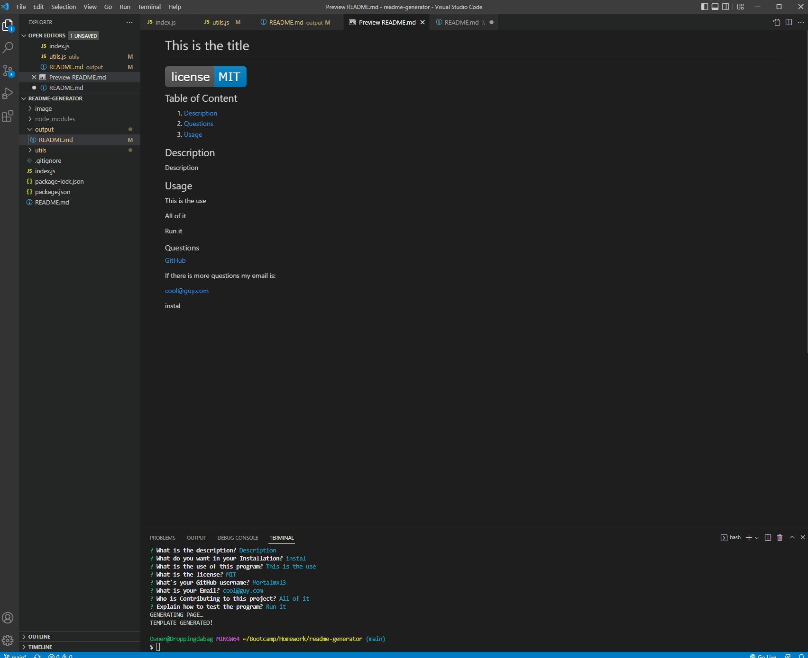

# readme-generator

## Table of Contents
1. [Description](#description)
2. [Visuals](#visuals)
3. [Resources](#resources)

## Description

This was to make a program that would write a README for the user with the users input.

## Visuals

## Resources
- [Live Site](https://mortalmx13.github.io/readme-generator/)

- [Respository](https://github.com/Mortalmx13/readme-generator)